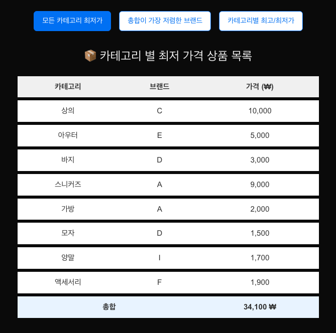
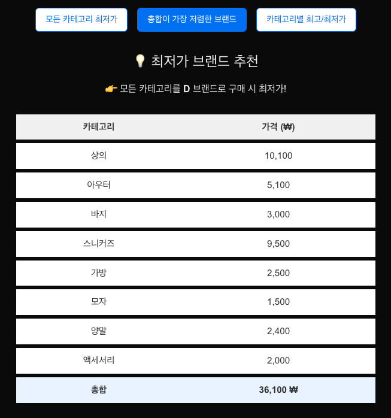
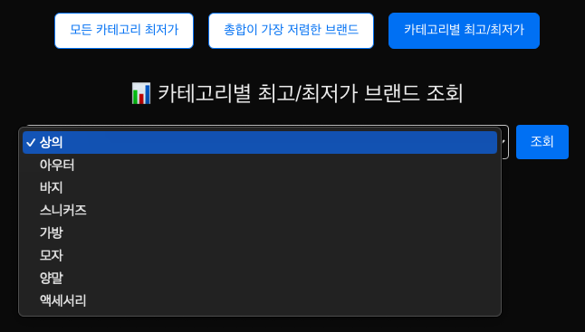
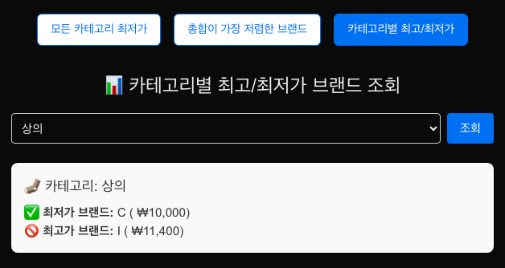

# 코디 서비스

## 📘 API 명세서
보다 자세한 사항과 테스트는 Swagger 를 통해서 확인하실 수 있습니다.

---

### **카테고리**
| HTTP Method | Endpoint               | 설명                      |
|-------------|------------------------|---------------------------|
| `GET`       | `/api/category`        | 전체 카테고리 목록 조회   |

### **상품**
| HTTP Method | Endpoint                    | 설명        |
|-------------|-----------------------------|-------------|
| `POST`      | `/api/product`              | 상품 등록   |
| `PUT`       | `/api/product/{productId}`  | 상품 수정   |
| `DELETE`    | `/api/product/{productId}`  | 상품 삭제   |

### **브랜드**
| HTTP Method | Endpoint                   | 설명         |
|-------------|----------------------------|--------------|
| `POST`      | `/api/brand`               | 브랜드 등록  |
| `PUT`       | `/api/brand/{brandId}`     | 브랜드 수정  |
| `DELETE`    | `/api/brand/{brandId}`     | 브랜드 삭제  |

### **추천**
| HTTP Method | Endpoint                                             | 설명                                  |
|-------------|------------------------------------------------------|---------------------------------------|
| `GET`       | `/api/recommendation/product/min-price-per-category` | 카테고리별 최저가 상품 조회           |
| `GET`       | `/api/recommendation/category/price-range`           | 카테고리별 가격 범위 조회             |
| `GET`       | `/api/recommendation/brand/min-total-price`          | 최저가 브랜드 추천                    |

---

## 🌳 코드 구조

```
├── RecommendationServiceApplication.java
├── config
├── controller
│   ├── BrandController.java
│   ├── CategoryController.java
│   ├── ProductController.java
│   └── RecommendationController.java
├── domain
│   ├── dto
│   │   ├── request
│   │   │   ├── CreateBrandRequest.java
│   │   │   ├── CreateProductRequest.java
│   │   │   ├── UpdateBrandRequest.java
│   │   │   └── UpdateProductResquest.java
│   │   └── response
│   │       ├── ApiSuccessResponse.java
│   │       ├── BrandLowestPriceDto.java
│   │       ├── BrandRecommendationResponse.java
│   │       ├── BrandWithPriceDto.java
│   │       ├── BrandWithTotalDto.java
│   │       ├── BrandWithTotalPriceDto.java
│   │       ├── CategoryDto.java
│   │       ├── CategoryPriceDto.java
│   │       ├── CategoryResponse.java
│   │       ├── ErrorResponseDto.java
│   │       ├── MinAndMaxPriceProductsResponse.java
│   │       ├── MinMaxProductDto.java
│   │       ├── MinPricePerCategoryItem.java
│   │       └── MinPricePerCategoryResponse.java
│   ├── entity
│   │   ├── Brand.java
│   │   ├── Category.java
│   │   └── Product.java
│   └── model
│       ├── BrandModel.java
│       └── ProductModel.java
├── exception
│   ├── BaseException.java
│   └── ErrorCode.java
├── handler
│   └── GlobalExceptionHandler.java
├── repository
│   ├── BrandJpaRepository.java
│   ├── CategoryJpaRepository.java
│   └── ProductJpaRepository.java
├── service
│   ├── BrandService.java
│   ├── BrandServiceImpl.java
│   ├── CategoryService.java
│   ├── CategoryServiceImpl.java
│   ├── ProductService.java
│   ├── ProductServiceImpl.java
│   ├── RecommendationService.java
│   └── RecommendationServiceImpl.java
└── strategy
    ├── BrandSelectionStrategy.java
    ├── BrandSortedMinMaxStrategy.java
    ├── FindFirstBrandSelectionStrategy.java
    ├── FindFirstMinPriceProductStrategy.java
    ├── MinAndMaxCategorySelectionStrategy.java
    └── MinPriceCategorySelectionStrategy.java


```

# ✨ 주요 기능 및 설계 

## 1. 도메인 선정 및 설계 배경
이 프로젝트는 브랜드, 카테고리, 상품으로 구성된 의류/패션 기반의 추천 시스템을 다루며, 실제 서비스에서 발생할 수 있는 아래의 시나리오를 기반으로 도메인 구조를 설계했습니다.

또한 **특정 브랜드의 특정 카테고리의 상품은 1개만 존재한다는 제약**을 기준으로 도메인 모델링을 진행했습니다. 

### ✅ 핵심 도메인
**1. Brand**
- 브랜드명은 고유해야 하므로 name 필드에 UNIQUE 제약을 두었고, 이를 통해 빠른 조회와 중복 방지를 달성합니다.

**2. Category**
- 상의, 하의, 아우터 등으로 구성된 고정된 범주의 분류 단위이며, 이 역시 name에 UNIQUE 제약을 두어 중복을 방지합니다.

**3. Product**
- 상품은 특정 브랜드의 특정 카테고리에서 유일하게 존재해야 한다는 비즈니스 제약이 있습니다.
- 복합 유니크 제약
```java
@Table(name = "product",
    uniqueConstraints = {
        @UniqueConstraint(columnNames = {"brand_id", "category_id"})
    }
)
```
- 만약 같은 브랜드가 동일한 카테고리에 여러 상품을 등록해야 하는 경우가 생긴다면,
  이 설계를 변경하고 복합 유니크 제약 제거 + 별도 식별 키 추가 등의 방식으로 확장 가능하도록 고려해두었습니다.

---

## 2. 서비스 인터페이스 분리
모든 도메인 서비스는 인터페이스-구현체 구조로 작성되었습니다.  
- 다양한 구현체 교체 (InMemory, RDB, External API 등)
- 유지보수 시 OCP(Open-Closed Principle) 기반의 확장 가능한 구조
- 의존 역전 원칙(DIP), 상위 계층에서는 오직 인터페이스만 의존

위와 같은 이점을 고려해서 설계했습니다.

---

## 3. 복잡한 비즈니스 로직, 쿼리 vs 코드

이 프로젝트에서 가장 많이 고민한 부분 중 하나는 **복잡한 비즈니스 로직을 DB 쿼리로 해결할 것인가, 애플리케이션 코드로 처리할 것인가?** 였습니다.
이에 대한 고민을 아래와 같이 정리하였고, 전략 패턴 적용과 함께 코드 기반 처리를 선택했습니다.

### 코드로 처리할 경우의 고려사항
- 가독성이 뛰어나고, 복잡한 비즈니스 조건 삽입이 용이
- 단위 테스트 작성이 훨씬 수월
- 전략 패턴 등 OOP 설계원칙 적용 및 확장성 보장
- **전체 데이터를 애플리케이션에서 필터링하기 때문에, 데이터량이 많을 경우 성능 이슈 발생 가능하다는 단점이 존재**

### 쿼리로 처리할 경우의 고려사항
- 성능 측면에서 유리할 수 있음
- 하지만 쿼리 복잡도가 높아지면 유지보수 비용 증가
- 테스트 작성이 까다로움 (Mocking 어렵고, DB 종속도 높아짐)

> SQL에서는 로직을 최소화하고, 가능한 한 애플리케이션에서 로직을 처리하도록 구성했습니다. 그래야만 테스트가 쉽고, 기능 확장에도 유리합니다.
> 또한 DB 서버 리소스보다 애플리케이션 서버 확장이 훨씬 유연하기 때문에, 성능상의 유연성도 확보됩니다.
> <br>"DB는 저장소 역할에만 충실하라" 는 핵심 원칙을 지키며 성능을 고려한 코드를 작성했습니다.

### 🔄 최종 결론
이러한 고민 끝에, 전략 패턴 도입과 함께 적절한 계층 경계를 선정하였습니다.
- 애플리케이션이 주도적으로 도메인 로직을 다루며
- 저장소 계층은 정제된 데이터 제공 역할에 집중합니다.

결과적으로 확장 가능하고, 테스트 가능한, 유연한 서비스 구조를 만들어냈습니다.

---

## 4. 추천 API 설계 및 전략 패턴 적용
이 프로젝트에서는 카테고리별 최저가, 브랜드별 총액 최저가, 카테고리 내 최저/최고가의 3가지 추천 API를 제공합니다.
추천을 할 때 여러가지 상황을 고려했습니다. (최저가 상품이 여러개일 경우, 총액이 같은 브랜드가 여러개일 경우 등 .. )

각 API는 **전략(Strategy) 패턴**을 활용하여 추천 기준에 따라 유연하게 동작하도록 설계되었습니다.

### 1. ✅ 카테고리별 최저가 상품 추천 API
> 전략 클래스: MinPriceCategorySelectionStrategy

- 목표: 각 카테고리마다 가장 저렴한 상품을 추천
  - 단순히 SQL에서 집계하는 것이 아닌, 복수의 최저가 상품이 존재할 경우 정책적으로 하나를 선택해야 함
  - `FindFirstMinPriceProductStrategy` 를 구현해 가격이 동일한 경우, **카테고리 아이디**를 기준 우선순위로 필터링

### 2. ✅ 브랜드별 최저 총액 상품 조합 추천 API
> 전략 클래스: BrandSelectionStrategy

- 목표: 하나의 브랜드에서 모든 카테고리를 구성했을 때 총합이 가장 저렴한 브랜드를 추천
  - DB 조회 시 브랜드별 총액을 계산하여 최소값을 조회
  - `FindFirstBrandSelectionStrategy` 를 구현해 총액이 동일한 경우, **브랜드 아이디**를 기준으로 우선순위로 필터링
  - 브랜드를 선택한 후 해당 브랜드의 전체 상품을 반환

### 3. ✅ 카테고리 내 최저가/최고가 브랜드 추천 API
> 전략 클래스: MinAndMaxCategorySelectionStrategy

- 목표: 하나의 카테고리에서 가장 저렴한 브랜드와 가장 비싼 브랜드를 비교
  - 유저가 카테고리 내에서 브랜드별 가격 편차를 비교할 수 있도록 설계
  - `BrandSortedMinMaxStrategy` 를 구현해 동일한 가격의 경우 **브랜드 아이디**를 기준으로 우선순위로 필터링

> 전략 객체를 갈아끼우기만 하면 다양한 추천 기준을 추가할 수 있었으며, 가격 외 기준(브랜드 평점, 재고, 트렌드 등)으로도 
확장이 쉬운 구조를 가지게 하기 위해 위와 같은 전략 패턴을 적용했습니다.

---

## 5. 코드 품질 분석
유지보수성과 확장성을 고려하여 코드 품질을 매우 중요하게 생각했습니다. 다음과 같은 도구 및 기준을 통해 코드 품질을 지속적으로 개선했습니다.

### ✅ Code Metrics 기반의 복잡도 관리
- 순환 복잡도(Cyclomatic Complexity) 분석을 통해 비즈니스 로직의 복잡도를 정량적으로 측정하고 관리했습니다.
- 복잡한 조건문과 분기 처리를 전략 패턴, DTO 분리 등을 통해 단순화했습니다.
- 가능한 한 단일 책임 원칙(SRP) 을 지키며, 하나의 메서드가 한 가지 일만 수행하도록 리팩토링을 반복했습니다.
  
### ✅ SonarQube를 통한 정적 코드 분석
- SonarQube를 통해 Code Smell, Bug, Coverage, Duplications 등 다양한 항목에 대해 검증을 진행했습니다.
- 특히 중복 코드 제거, 미사용 코드 제거 등의 지표를 개선하며 신뢰도와 유지보수성을 향상시켰습니다.

또한 코드 전체에 대한 검수를 진행하며 `N+1` 문제와 같은 비효율적인 기능에 대한 검수도 진행했습니다.
---

## 6. 빌드 및 실행 방법
- Configuration 에 `local.env` 파일을 추가해주세요.
- java Compiler 에 `-parameters` 를 추가해주세요.
- 기능 테스트와 명세는 Swagger 를 통해서 확인할 수 있습니다.

## 7. 프론트
`Next.js` 를 통해서 프론트 페이지를 구성했습니다.

[Github](https://github.com/iamseung/M-View) 에서 확인할 수 있으며, 이를 직접 실행하실 때,
Next.js는 3000번 포트, Spring Boot 는 8000번 포트로 지정하시고 실행을 권장드립니다.

### 1. 카테고리별 최저가 상품 조회


### 2. 단일 브랜드 최저가 추천


### 3. 카테고리별 가격 범위 조회


사용자의 불필요한 카테고리 입력을 방지하기 위해, 카테고리 데이터를 API 를 통해 가져와 Select Box 로 선택할 수 있게 했습니다.



